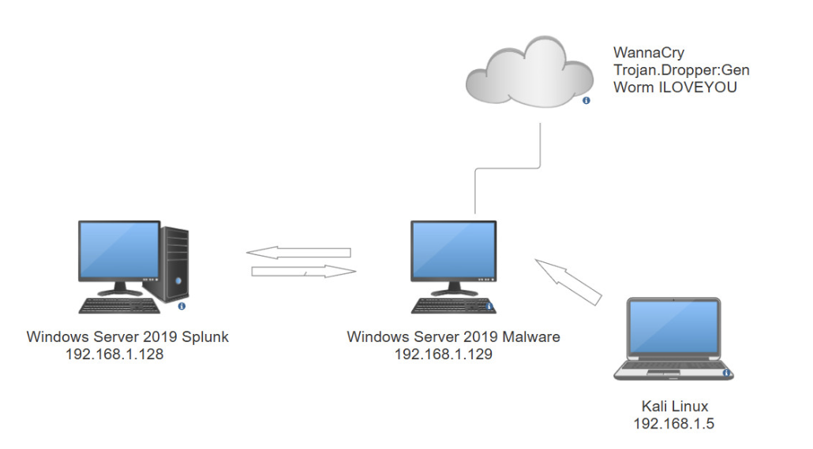

# Malware Behavior Analysis using Splunk

## Overview
This project focuses on detecting suspicious malware behaviors using Splunk and Sysmon logs.

## Tools
- Splunk
- Sysmon
- Windows VM
- MITRE ATT&CK

## Detection Scenarios
- PowerShell abuse
- Registry persistence
- Suspicious process creation

### Network Diagram

